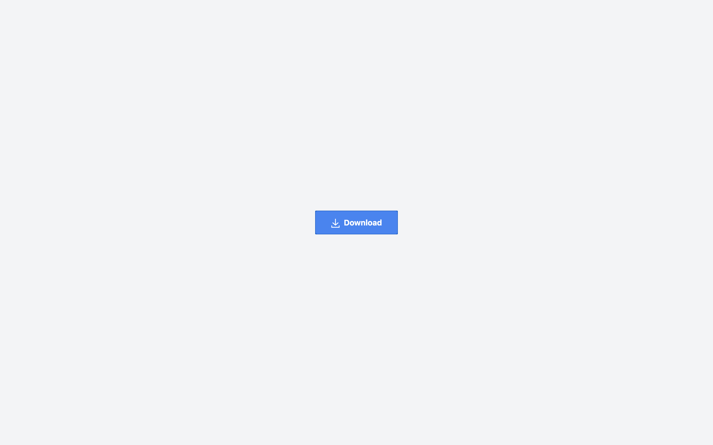

# Animated Download Button

## Table of Contents
- [Overview](#overview)
- [Demo](#demo)
- [Features](#features)
- [Installation](#installation)
- [Usage](#usage)
- [Contributing](#contributing)
- [Acknowledgments](#acknowledgments)
- [License](#license)
- [Author](#author)

## Overview
A delightful Animated Download Button designed to enhance user experience by adding a smooth ripple effect on each click. Elevate the interactivity of your website with this elegant button.

## Demo
Check out the live demo on CodePen: [Animated Download Button](https://codepen.io/karlhorning/pen/gOErPxg)

## Features
- Smooth ripple effect
- Enhances user engagement
- Easy to integrate into web projects

## Installation
Simply include the necessary HTML, CSS, and JavaScript files in your project. You can also use the provided CodePen demo as a reference.

## Usage
Add the `ripple-container` class to your button container, and ensure the necessary styles and scripts are included. See the demo for a quick implementation guide.

## Contributing
Contributions are welcome! Feel free to open issues or submit pull requests to improve the project.

## Acknowledgments
- [Tailwind CSS](https://tailwindcss.com/) - Used for styling
- [CodePen](https://codepen.io/) - Hosting the live demo

## License
This project is licensed under the MIT License - see the [LICENSE](LICENSE) file for details.

## Author
**Karl Horning:**
- [GitHub](https://github.com/Karl-Horning/)
- [LinkedIn](https://www.linkedin.com/in/karl-horning/)
- [CodePen](https://codepen.io/karlhorning)
